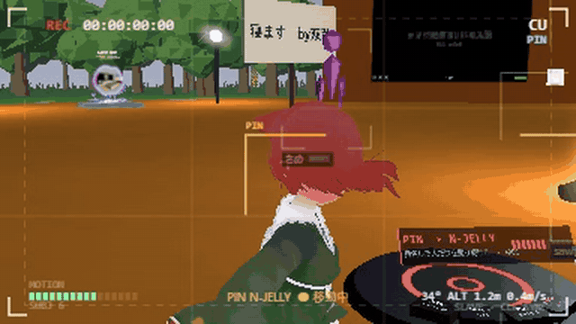

# Cine Drone Camera（XRift アイテム）

XRift のワールドに置く自律飛行型の撮影ドローンです。その場にいる人を自動で追跡し、動きや注目度を見てカットを切り替えながら飛び回ります。ドローン視点の映像は現場モニタにリアルタイムで表示され、REC ボタン一つで `.webm` 動画として保存できます。



放送現場のドローンカメラを、マルチユーザー空間の上で自動化したものと考えてください。運営側は設置するだけでよく、誰も操作しなくても撮影が続きます。

## セットアップ

```bash
npm install
npm run dev          # http://localhost:5199 で開発用シーンが起動
npm run build        # 本番ビルド
npm run typecheck
xrift upload item    # XRift へのアップロード（xrift CLI が必要）
```

## ワールドへの設置

```tsx
import { Item } from '@xrift/recording-camera'

<Item position={[0, 0, -4]} quality="high" />
```

すべての props は省略可能です。

### Props

| Prop | 既定値 | 説明 |
|---|---|---|
| `position` / `rotation` / `scale` | — | 設置トランスフォーム |
| `mode` | `'auto'` | 初期モード（設置後はボタンで切り替え可能） |
| `range` | `22` | 設置位置からの最大水平飛行距離（m） |
| `minAltitude` | `0.45` | 床からの最低高度（m） |
| `maxAltitude` | `14` | 設置位置からの最高高度（m） |
| `handheld` | `0.55` | 手ブレの強さ。`0` で完全に滑らかに |
| `showMonitor` | `true` | 現場モニタを表示するか |
| `monitorWidth` | `1.5` | モニタの横幅（m） |
| `quality` | `'normal'` | 画質プリセット（後述） |
| `feedWidth` / `feedHeight` | プリセット依存 | 解像度の直接指定（`quality` より優先） |
| `feedFps` | プリセット依存 | ドローン視点の描画 fps |
| `recordFps` | プリセット依存 | 録画 fps |
| `cullDistance` | `32` | この距離より遠いクライアントでは映像パスを止める |
| `shadows` | `true` | 機体とモニタの影。`false` で影パスから完全に外れる |

### 画質プリセット

解像度はモニタに映る絵と録画される `.webm` の両方に適用されます。既定は軽さ優先の `normal` で、録画をきれいに残したいワールドでは `high` 以上を推奨します。

| `quality` | 解像度 | fps | ピクセル数（`normal` 比） |
|---|---|---|---|
| `low` | 256x144 | 15 | 0.44x |
| `normal`（既定） | 384x216 | 20 | 1x |
| `high` | 640x360 | 24 | 2.8x |
| `ultra` | 960x540 | 30 | 6.2x |

```tsx
<Item quality="high" />
<Item feedWidth={1280} feedHeight={720} />
```

## 撮影モード

操作 UI は 2 か所（浮遊モニタの下と台座）にあり、どちらもデスクトップでも VR でも押せます。押した結果はその場の全員に同期されます。

| モード | 誰を撮るか | 動作 |
|---|---|---|
| `AUTO` | おまかせ | 動き・ジャンプ・視線から注目度を算出し、主役を自動選択 |
| `ACTION` | よく動く人 | 運動量が最も高い人を追走（TRK / ORB / LOW のみ使用） |
| `PIN` | 指名した人 | 選んだ 1 人だけを撮り続ける。離脱時は自動で他の人へ移行 |
| `FOLLOW ME` | 自分 | 操作した本人だけを撮り続ける |
| `ORBIT` | 全員 | 全員の周りを回り続ける |
| `PARK` | 停止 | 台座に戻りホバリング |

### 操作方法

**モニタ下部のパネル**（主操作）

- **モードチップ 6 個** — 押したモードがハイライトされる
- **◀ PREV / NEXT ▶** — フォーカス対象を 1 人ずつ切り替え（押すと `PIN` に入る）
- **フォーカス表示** — 現在の主役の名前・選択理由・運動量メーター

**台座の 4 ボタン**（モニタを表示しない設置でも一通り操作可能）

- **MODE** — 次のモード名を面に表示してから切り替え
- **NEXT ▶** — 次の人へフォーカス（`PIN` に入る）
- **CUT** — 次のカットへ即座に切り替え
- **REC** — `● REC` / `■ STOP` を切り替え。停止すると手元端末に `.webm` を保存

## 同期の仕組み

ドローンの座標を毎フレーム同期すると通信量が膨大になるため、**カット割りのみ**を `useInstanceState` で同期します。

```
カット開始時: shot / ids / startedAt / duration / seed / mode を 1 回送信
    ↓
各クライアントが同一 seed から同一乱数列を生成し、同一の式で軌道を計算
    ↓
全クライアントでドローンが同一の位置を飛ぶ（座標データは送信しない）
```

- 同期の書き込みは、参加者 ID 順で先頭のクライアント（ディレクター役）が担当
- ディレクターのタブがバックグラウンドに回り `requestAnimationFrame` が止まった場合、3.2 秒の沈黙を検知して他のクライアントが自動的に役割を引き継ぐ（`DIRECTOR.STALE_TAKEOVER_MS`、[src/camera/constants.ts](src/camera/constants.ts)）
- 時刻は `useServerClock()` を使用。同期できない場合は端末時計へフォールバック

## 録画の仕組み

```
WebGL レンダーターゲット → readRenderTargetPixelsAsync（PBO）→ 2D canvas 合成
  → captureStream → MediaRecorder → .webm
```

- 録画は**映像のみ**。音声トラックは含みません（理由は後述）
- 録画ファイルは各クライアントのローカルに保存され、他の参加者には共有されません
- 対応フォーマットは VP9 → VP8 → WebM → MP4 の順で自動選択されます

## 音声を扱わない理由

XRift には「誰が話しているか」を取得する API が存在しません（`useVoiceVolumeOverride` は音量の書き込み専用です）。

プラットフォームが鳴らしている音を Web Audio で横取りして話者を推定する実装も試みましたが、読み込み順序・ボイス実装・音源とアバターの対応付けに依存して破損しやすく、障害時に原因を追いにくいため、この方針は撤去しました。

現在は**音声を一切使用せず**、動き・ジャンプ・視線（他ユーザーの注視数）のみで主役を決定します。注目を集めている人がその場の中心にいる傾向があるため、実用上は十分機能します。

この設計の結果：

- 録画は映像のみになる（音声を入れるには音声グラフへのアクセスか `navigator.mediaDevices` が必要）
- `AudioContext` / `AnalyserNode` を生成しない

## パフォーマンス設計

- `useFrame` の `priority` は `0` のまま維持。R3F の自動描画を維持し、オフスクリーンパスは「レンダーターゲットの一時差し替え + 1 パス追加」で実装
- POV パス中はモニタと機体を一時的に非表示化（自己映像のテクスチャ書き込みによるフィードバックループ防止）
- VR 中は POV パスの間だけ `gl.xr.enabled` を無効化（XR カメラでの誤描画防止）
- 実光源（`PointLight` 等）は 1 つも配置しない。飛翔するオブジェクトが光源を持つとワールド全体のマテリアルにライトコストが加算されるため、表示上の光は emissive マテリアルのみ
- **モニタが画面外のフレームでは POV パスを完全にスキップ**（実測: モニタ正面で 1.2 秒あたり 22 パス → 画面外で 0 パス）。録画中は強制実行
- モニタとの距離に応じて POV パスと HUD の更新頻度を段階的に低減（近接時 20fps / 12fps、遠方時 6fps / 4fps）
- 機体の静的パーツはマテリアルごとに 1 メッシュへ統合（42 → 14 メッシュ、三角形数は約 1,500）
- ボタンやラベルの文字は 1 枚のテクスチャアトラスに集約し UV で切り出し。**マテリアル 31 → 17、テクスチャ 17 → 5、メッシュ 48 → 36** に削減
- 影は機体とモニタのみがキャスト（`shadows={false}` で全オフ）

## ソース構成

```
src/
  Item.tsx                  毎フレームの処理フローを構成する（唯一の useFrame）
  camera/
    useSubjects.ts          ユーザー → 被写体変換。注目度スコア（動き・ジャンプ・視線）の計算
    shots.ts                ショットカタログ 10 種。すべて純関数
    useDirector.ts          いつ・誰を・どう撮るかの決定。インスタンス同期とディレクター選出
    useDroneRig.ts          望ましい姿勢への機体追従（バンク・手ブレ・ジンバル）
    useCameraFeed.ts        ドローン視点のオフスクリーン描画
    hud.ts                  ビューファインダ HUD（2D キャンバス）
    useRecorder.ts          ピクセルリードバック → 合成 → MediaRecorder
    platform.ts             Provider 外でも動作するよう Context を安全に読む
    constants.ts / types.ts / math.ts
  parts/
    Drone.tsx               機体の外観。静的パーツをマテリアルごとに統合
    Monitor.tsx             浮遊モニタとその下部の操作パネル
    Dock.tsx                離着陸パッドと台座ボタン
    PanelButton.tsx         押下可能なボタン（台座・モニタ共通）
    canvasTexture.ts        ボタン文字のアトラスと状態表示パネル
    mergeGeometry.ts        同一マテリアルの小パーツのジオメトリ統合
  index.tsx                 アイテムのエクスポート（Module Federation エントリ）
  devScene.tsx              開発用テストシーン（ダミー参加者 4 名）
  dev.tsx                   npm run dev のエントリ
  dev-headless.tsx          headless 検証用エントリ（後述）
```

### ショットカタログ

10 種類のショットがすべて純関数で実装されています（被写体位置 + カット開始時の乱数列のみを入力とする）。

| label | ショット | 内容 |
|---|---|---|
| WS | Wide | 全員を収める広角。やや高所からゆっくり旋回 |
| MS | Medium | 5 人程度を中景で撮る |
| CU | Closeup | 主役の顔へゆっくり寄る |
| OTS | Over-the-Shoulder | 主役の肩越しに最も近い相手を撮る |
| ORB | Orbit | 主役の周囲を回り込む |
| CRN | Crane | 低位置から高位置へ一気に上げる |
| DLY | Dolly | 全員を収めたまま横に移動 |
| TRK | Tracking | 走っている人を後方から追走 |
| LOW | Low | 床すれすれから見上げる |
| TOP | Top Down | 全員を真上から俯瞰 |

## 開発

```bash
npm run dev        # http://localhost:5199
```

開発シーンでは、決定論的な軌道で歩き回るダミー参加者 4 名が配置されます（カット割りの挙動は毎回同一順序で再現）。台座とモニタのボタンはクリックで押せます。

### headless 検証

`<Canvas>` は ResizeObserver 経由でコンテナサイズを測定するため、**タブが非表示だと WebGL 初期化が始まりません**。CI や自動検証でフレームを進めたい場合のために、R3F の命令型 API でサイズを直接指定して起動する headless エントリを用意しています。

```
http://localhost:5199/dev-headless.html?w=1280&h=720
```

コンソールから:

```js
__dev.step(60)                 // 60 フレーム進める（frameloop は 'demand'）
__dev.shot('name')             // canvas を PNG 化し .dev-shots/name.png へ保存
__dev.state                    // R3F の RootState
```

`POST /__shot` は `vite.config.ts` に定義された dev 専用プラグイン（`apply: 'serve'`）のエンドポイントで、本番ビルドには含まれません。

## Shared 依存関係

このアイテムは [Module Federation](https://module-federation.io/) を使用しており、以下のパッケージはホスト（xrift-frontend）と共有されます。アイテムのバンドルにはインライン化されません。

| パッケージ | バージョン |
|---|---|
| `react` / `react-dom` | ^19.0.0 |
| `three` / `three/addons` | ^0.183.1 |
| `@react-three/fiber` | ^9.3.0 |
| `@react-three/rapier` | ^2.1.0 |
| `@react-three/drei` | ^10.7.3 |
| `@react-three/uikit` / `@pmndrs/uikit` | ^1.0.0 |
| `@xrift/world-components` | ^0.47.0 |

`three/addons` も共有対象です。`DRACOLoader` / `GLTFLoader` は必ず `three/addons/*` からインポートしてください。バンドルにインライン化されると `new Worker()` 等が `@xrift/code-security` の critical 違反として検出されます。

なお、このアイテムは**ボタンの文字を含め外部アセットを一切読み込みません**。drei の `<Text>`（troika）はフォントを CDN から取得するため使用せず、すべての文字は 2D キャンバスをテクスチャ化して貼り付けています。

## セキュリティ審査

`@xrift/code-security` の全ルールに対し、critical / warning ともに **0 件**です。`localStorage` / `fetch` / `eval` / `innerHTML` / `navigator.*` / Web Audio のいずれも使用していないため、`xrift.json` への `permissions` 宣言は不要です。

## ライセンス

MIT